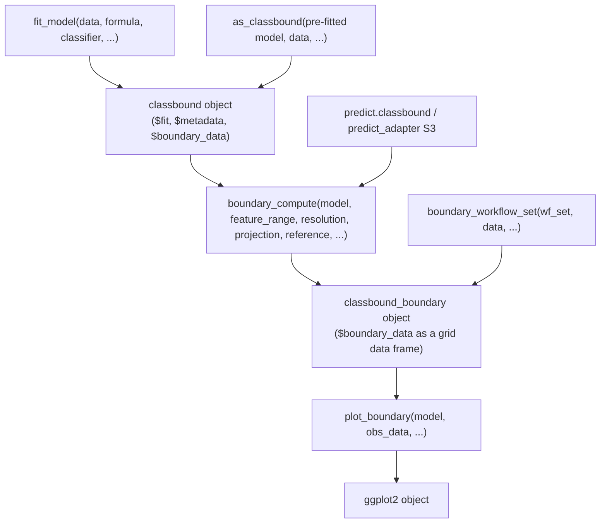
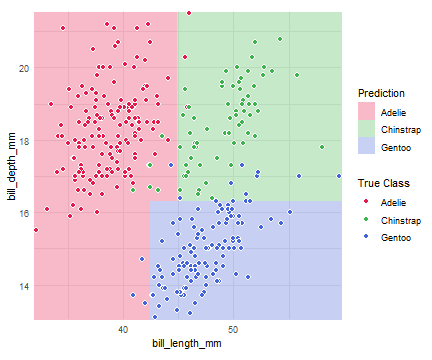
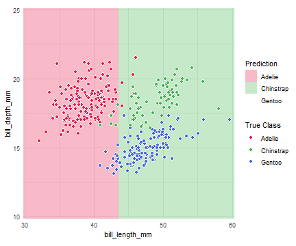
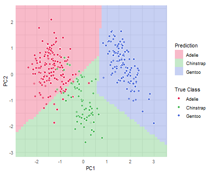
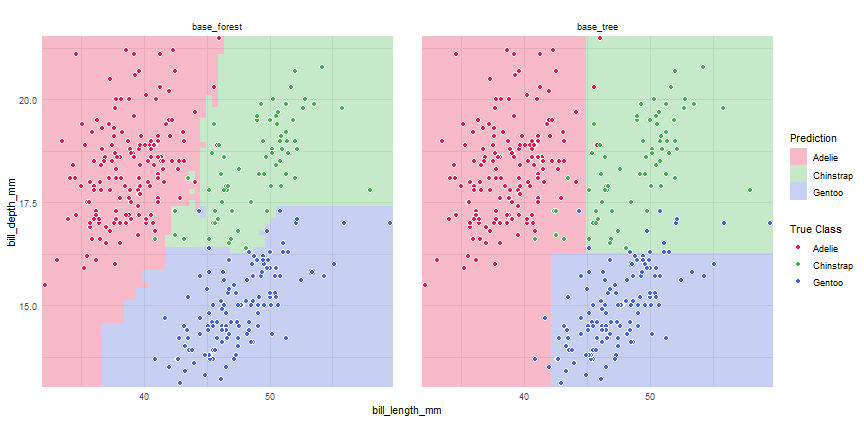

# Google Summer of Code 2026: Final Report for classbound

- **Contributor:** Vaibhav Manihar
- **Organization:** R Project for Statistical Computing
- **Mentors:** Natalia da Silva, Ignacio Alvarez-Castro
- **Project page:** [GSoC 2026: classbound](https://summerofcode.withgoogle.com/programs/2026/projects/QYMNbHhk)
- **Upstream repository:** [natydasilva/classbound](https://github.com/natydasilva/classbound)

---

`classbound` is an R package for visualizing and comparing classification decision boundaries. It provides a unified interface for fitting classifiers, computing 2D boundary grids, and plotting the results, with support for native R classifiers, tidymodels workflows, and custom user-supplied models. The package also supports high-dimensional data through 2D slicing and projection-based visualization, and includes an interactive Shiny application (`explorapp`) for point-and-click boundary exploration.

This report documents what I built during GSoC 2026 and the architecture that resulted.

---

## Project Goals

The original proposal aimed to turn a collection of early prototype code into a publishable R package. The key goals were:

1. Design and implement a modular, extensible classifier interface (`fit_model`, `predict_model`, `classbound` object)
2. Implement the boundary computation pipeline for 2D grids
3. Add visualization via `plot_boundary`
4. Extend to high-dimensional data using 2D slicing and linear projection (including PCA and `tourr`)
5. Support multi-model comparison
6. Build an interactive Shiny application (`explorapp`) for visual exploration
7. Add data simulation utilities
8. Write tests, vignettes, and pkgdown documentation

All of these goals were addressed during GSoC.

---

## Starting Point

When GSoC began, the repository (which had been started by my mentor Natalia da Silva) contained early prototype code: a package skeleton, some initial data, and early boundary-visualization logic using a Shiny-based system.

The starting architecture used string-based model routing (you selected a model by passing `method = "rpart"`) and maintained a complex S3 hierarchy with per-classifier adapter classes (`classbound_rpart`, `classbound_method`, etc.). There was no common model wrapper, and the prediction logic was distributed across multiple per-classifier adapter files.

This design had two main problems. First, supporting any new classifier required writing dedicated adapter code. Second, the string-based routing made it hard to support user-supplied classifier functions at all.

My first task, established in discussion with my mentor, was to redesign the architecture around a single common model class and a function-argument interface. This meant accepting classifier *functions* instead of string names, collapsing the S3 hierarchy into one class, and keeping the modular pipeline (`fit_model` to `boundary_compute` to `plot_boundary`) while adding the unified one-step `classbound()` wrapper.

---

## Architecture

The resulting architecture separates fitting, prediction, boundary computation, and visualization into distinct components.



### classbound object

`fit_model()` returns a list of class `"classbound"` containing:

- `$fit`: the raw fitted model object (e.g., an `rpart` or `randomForest` object)
- `$metadata`: feature names, types, ranges, imputation values, and class levels captured at fit time
- `$boundary_data`: `NULL` until `boundary_compute()` is called

Storing metadata at fit time is critical. When `boundary_compute()` generates an artificial prediction grid, it needs to know which columns to include, which values to impute for non-plotted dimensions, and what factor levels to enforce on the output. Without this, boundary grids silently crash or produce wrong predictions on common classifiers.

After `boundary_compute()`, the object gains the additional class `"classbound_boundary"`. For multi-model input, it also gains `"classbound_multi"` and stores the individual fitted models in `$fits`.

### fit_model and the interface argument

`fit_model()` dispatches on the class of the `classifier` argument. It accepts:

- A plain R function: `fit_model(data, formula, rpart::rpart)`
- A string function name: `fit_model(data, formula, "rpart::rpart")`
- A parsnip `model_spec` or fitted `model_fit`
- A tidymodels `workflow`

The `interface` argument (`"formula"`, `"matrix"`, or `"custom"`) controls how the classifier is called. Most classifiers use `"formula"`. `randomForest` requires `"matrix"` because it expects separate `x` and `y` arguments. `"custom"` lets the user control the call entirely via `fit_args`.

### predict_adapter S3

R classifiers do not return predictions in a consistent format: `rpart` returns a factor for class labels but a matrix for probabilities, `randomForest` returns a factor or a matrix depending on the call, and `PPtreeViz` returns a list with a `predict.class` field. Rather than handling these differences inside `boundary_compute()`, I kept a thin `predict_adapter` S3 generic that normalizes each classifier's output into a standard `list(class, probs)` structure. The `class` element is a factor of predicted labels; `probs` is a probability matrix or `NULL` if the classifier does not support class probabilities.

The `predict.classbound` method first subsets `newdata` to the features the model knows about (preventing crashes when extra columns are present), then calls `predict_adapter`. It enforces class levels from the stored metadata on the output.

### boundary_compute

`boundary_compute()` generates a regular `resolution x resolution` grid over the two axis features, runs `predict_model()` over the grid, and stores the result in `$boundary_data` as a data frame with columns `x`, `y`, `prediction`, and per-class probability columns when available.

For high-dimensional models (more than two features), the function supports two modes:

- **2D slice**: the grid covers two selected features; all other features are filled with their training-set median (numeric) or mode (categorical), or with user-supplied values via the `reference` argument
- **Projection**: the grid is generated in a 2D projected space, then inverse-projected back to the original feature space before prediction; the model sees all its original features and the projection affects only the visualization axes

For multi-model input, the function validates that all models share identical feature names, types, and class levels before running. It returns a combined grid with a `model` column.

### plot_boundary

`plot_boundary()` takes a `classbound_boundary` object and returns a `ggplot2` plot. Key capabilities:

- Overlays observed training data as points
- Supports a probability gradient (`show_gradient = TRUE`) for classifiers that return probabilities
- For projected models: automatically forward-projects `obs_data` onto the 2D plane and applies depth fading (points far from the projection plane are rendered with lower opacity)
- Renders multi-model results with facets (`facet_col = "model"`)
- Supports a disagreement map (`type = "disagreement"`) that shows where models agree vs. differ
- Uses `classbound_palette()`, a curated 20-color palette with deterministic (alphabetical) class-to-color assignment

---

## Major Contributions

I worked directly in the upstream repository (`natydasilva/classbound`) using contributor access, rather than through a personal fork. All 61 commits attributed to me in the Git log are reflected in the main branch of that repository.

### Core classifier interface

**Commits:** `05da51d`, `87a164a`, `4c9d504`, `8ae5027`

I implemented `fit_model()`, `predict_model()`, and the `classbound` S3 class. The initial implementation used string-based model routing, which I then refactored to S3 dispatch on the classifier's class. A later refactor (`8ae5027`) unified the architecture and consolidated the adapter structure into its final form.

The key design choice was returning a single `"classbound"` class rather than per-classifier subclasses. This made multi-model support straightforward: a list of `classbound` objects can be validated against each other and iterated uniformly.

### Classifier adapters

**Commits:** `05da51d`, `12ad01a`, `0915654`, `77754aa`, `c64a462`, `09d460c`

I implemented `predict_adapter` S3 methods for:

| Adapter | Native class | Probability support |
|---|---|---|
| `predict_adapter.rpart` | `rpart` | yes |
| `predict_adapter.randomForest` | `randomForest` | yes |
| `predict_adapter.PPtreeExtclass` | `PPtreeExtclass` | no |
| `predict_adapter.PPtreeclass` | `PPtreeclass` (PPtreeViz) | no |
| `predict_adapter.pprf_classification` | `pprf_classification` (ppforest2) | yes |
| `predict_adapter.workflow` | tidymodels `workflow` | yes (when available) |
| `predict_adapter.model_fit` | parsnip `model_fit` | yes (when available) |

The default adapter (`predict_adapter.default`) calls base R `predict()` and returns `list(class, probs = NULL)`. It fails with a clear message if the native model returns a non-standard structure, prompting the user to supply a `predfun` instead.

Users can bypass adapters entirely by supplying a `predfun` argument to `fit_model()`, `boundary_compute()`, or `predict_model()`. This allows any classifier to work without requiring changes to the package.

### Boundary computation

**Commits:** `4c70bee`, `a35313c`, `0e7bc7e`, `18ff880`

I implemented `boundary_compute()` in commit `4c70bee`. The function generates an `expand.grid` over the two axis features at the requested resolution, builds a full prediction data frame (filling in missing features), runs predictions across the grid, and attaches the result to the `classbound` object.

The function validates all inputs: feature names must match the training data, `feature_range` must be a named list of length 2, `resolution` must be at least 2, and the projection basis (when supplied) must be numeric, orthonormal, and correctly sized.

### Fixed-value slicing

**Commit:** `a35313c`

When a model is trained on more than two numeric features, generating a full N-dimensional grid is not feasible: a 100-point grid over 10 features would require 10^10 predictions. Instead, `boundary_compute()` holds all non-plotted features at fixed reference values and renders a 2D cross-section of the boundary.

By default, numeric features are imputed at their training-set median and categorical features at their mode. The user can override any of these with the `reference` argument: `reference = list(flipper_length_mm = 200)`. The function validates that categorical reference values are valid factor levels.

A warning is issued listing which features were imputed automatically, so the user always knows what the slice represents.

### High-dimensional projection

**Commits:** `2b1bdb4`, `a729dab`, `a35313c`

I implemented the projection pathway in `boundary_compute()`. When a `projection` list is supplied, the 2D grid is generated in the projected space, then inverse-projected back to the original feature space using the transpose of the basis matrix:

```
x_original = z_projected %*% t(basis)
```

If `center` and `scale` vectors are included in the projection list (as returned by `prcomp()`), the inverse projection also undoes the standardization, placing the reconstructed points in the original feature units before prediction.

The `plot_boundary()` function forward-projects `obs_data` onto the 2D plane for overlay. It also computes each point's orthogonal distance from the projection plane and scales opacity by that distance, with fully on-plane points at `alpha = 1.0` and distant points fading toward `alpha = 0.2`. This depth fading is a visual signal about how faithfully the projection captures each observation's position.

The `tourr` package produces orthonormal basis matrices directly compatible with this interface. The vignette `tourr-workflow` demonstrates how to use `tourr::save_history()` to generate a projection sequence and apply it frame-by-frame to multiple models for animated comparison.

### Multi-model comparison

**Commits:** `53daddd`, `0e7bc7e`, `18ff880`

`boundary_compute()` accepts a named list of `classbound` objects as its `model` argument. Before computing anything, it validates that all models share the same feature names, feature types, and class levels. If any model differs, it stops with a specific error message.

The result is a `classbound_multi` object containing a combined grid with a `model` column. `plot_boundary()` detects this class and automatically sets `facet_col = "model"` to avoid overlapping panels.

The `type = "disagreement"` mode aggregates predictions across models at each grid point and renders a binary map: teal for regions where all models agree, orange for regions where they differ.

`boundary_workflow_set()` wraps a tidymodels `workflow_set`: it fits any untrained workflows, wraps each as a `classbound` object via `as_classbound()`, and passes the resulting list to `boundary_compute()`.

### Tidymodels integration

**Commits:** `c64a462`, `284f3bd`, `d1079d8`

`fit_model()` dispatches on `model_spec` and `model_fit` classes from parsnip, and on the `workflow` class from workflows. For `model_spec`, it calls `parsnip::fit(classifier, formula, data = data)` and wraps the result. For already-fitted `model_fit` objects, it skips fitting.

I also implemented `as_classbound()`, which wraps any pre-fitted model (including native R models, parsnip fits, and trained workflows) into a `classbound` object using training data to extract feature metadata. This is the entry point for "bring your own model" workflows.

An internal registry (`tidymodels_bridge.R`) maps Shiny UI engine names to their canonical parsnip model specifications. This powers the multi-model comparison panel in `explorapp()`.

### Interactive Shiny application (explorapp)

**Commits:** `2e523fc`, `b53c045`, `1666244`, `f9de799`, `d1079d8`, `30e0a52`, `f735b2b`, `c3d4029`, `09d460c`, `4ecea50`, `9882033`, `5ef9504`, `8e74fad`, `15a4adc`, `48a796d`, `f2b11c8`

`explorapp()` is the primary interactive interface, implemented as a single Shiny application in `R/app.R` with the following capabilities:

- **Data input**: upload a CSV, use a built-in dataset, simulate data, or draw classification data by hand
- **Drawing mode**: freehand brush drawing with adjustable brush size and continuous interpolation between brush strokes
- **Model selection**: choose from rpart, randomForest, PPtreeViz, PPtreeExt, ppforest2, or user-supplied custom models
- **Visualization modes**: 2D Slice and Projection (PCA-based), switchable at runtime
- **Outlier injection**: generate outliers outside the training data hull, control their count and distance, and observe how the boundary shifts in response
- **State caching**: fitted models and computed boundaries are cached in reactive values so switching visualization settings does not require refitting
- **Performance metrics**: an interactive `DT` table showing accuracy, precision, recall, and F1 for each fitted model
- **Probability gradient**: toggle probability-shaded boundaries for classifiers that support them
- **Export**: data (CSV), models (RDS), plots (PDF/PNG), metrics (CSV), and a reproducible R script

The app accepts an optional `data` and `target_col` argument so it can be pre-loaded with any data frame.

### Outlier visualization

**Commit:** `30e0a52`

The outlier workflow generates synthetic observations outside the convex hull of the training data. Their location is controlled by a distance parameter that scales how far beyond the training range the outliers appear. In `plot_boundary()`, the `highlight_outliers = TRUE` argument renders outlier observations as diamonds (shape 23) rather than circles, distinguishing them from regular training data visually.

### State caching

**Commit:** `30e0a52`, extended in later commits


The Shiny app caches fitted models and boundary data in reactive values keyed by model name and current feature configuration. When a user switches the visualization type (e.g., from 2D Slice to Projection) without changing the model or data, the cached boundary is reused instead of recomputed. This makes the app responsive for classifiers with slow fitting times.

### Simulation utilities

**Commits:** `c3d4029`, `4ecea50`

I added two data simulation functions:

- `simulate_mixsim()`: generates synthetic classification data using Gaussian mixture models via the `MixSim` package. Supports an independent test set via `test_ratio` (the test data is drawn from the same mixture parameters independently, not split from the training data).
- `simu_n()`: generates synthetic data by drawing independent multivariate normal samples for each class, with explicit control over class means and covariance matrices.

Both functions support a `noise_ratio` argument to add uniformly distributed background noise for testing classifier robustness, and a `seed` argument for reproducibility that restores the global random seed after the call.

### Testing

**Commits:** `9e6002b`, `0915654`, `3d9ac66`, `4ecea50`

The test suite spans 22 test files covering:

| Test file | Coverage |
|---|---|
| `test-rpart.R` | rpart adapter |
| `test-randomForest.R` | randomForest adapter |
| `test-pptree.R` | PPtreeExt adapter |
| `test-PPtreeViz.R` | PPtreeViz adapter |
| `test-ppforest2.R` | ppforest2 adapter |
| `test-boundary.R` | 2D boundary computation |
| `test-boundary-highdim.R` | high-dimensional boundaries |
| `test-boundary-compatibility.R` | standardized output structures across adapters |
| `test-comparison.R` | multi-model comparison |
| `test-projection.R` | projection and inverse-projection pipeline |
| `test-slicing.R` | fixed-value slicing and reference argument |
| `test-pipeline.R` | end-to-end pipeline integration |
| `test-preprocessing.R` | data preprocessing and validation |
| `test-tidymodels.R` | parsnip/workflow integration |
| `test-tidymodels_bridge.R` | Shiny tidymodels bridge |
| `test-simulation.R` | simulation utilities |
| `test-visualization.R` | plot_boundary outputs |
| `test-user_adapter.R` | custom predfun adapters |
| `test-palette.R` | classbound_palette |
| `test-app-helpers.R` | Shiny helper functions |
| `test-package.R` | package-level checks |

### Documentation

**Commits:** `5fbce29`, `8a1e480`, `82a775b`, `7a0ea61`, `f73e2f7`

I wrote:

- **6 vignettes**: `getting-started`, `high-dimensional`, `tidymodels-workflow`, `tourr-workflow`, `custom-adapters`, `explorapp-guide`
- **Roxygen documentation** for all exported functions (36 `.Rd` files)
- **README.Rmd** with quick-start examples and output figures
- **pkgdown** site configuration (`_pkgdown.yml`) and CI workflow

---

## Technical Decisions

### Single S3 class instead of per-classifier subclasses

The early architecture defined a class per classifier (`classbound_rpart`, `classbound_rf`, etc.), which meant that supporting any new model required adding dedicated dispatch and adapter code for it. Collapsing to a single `"classbound"` class solves this: the raw fitted model is stored in `$fit`, and adapters dispatch on `class(model$fit)`. Adding support for a new classifier now requires only a `predict_adapter.<native_class>` method, or nothing at all if the classifier's native `predict()` already returns class labels directly. This also makes multi-model comparison straightforward, since a list of `classbound` objects can be validated and iterated uniformly without branching on model type.

### Keeping predict_adapter alongside native predict()

Different classifiers return predictions in different formats from `predict()`: `rpart` returns a factor for class labels but a matrix for probabilities, `randomForest` returns a factor or a matrix depending on the call, and `PPtreeViz` returns a list with a `predict.class` field. Handling these differences inside `boundary_compute()` would mix classifier-specific logic into the grid computation. Instead, a thin `predict_adapter` S3 layer normalizes each classifier's output into a consistent `list(class, probs)` structure before the grid code sees it. The `predfun` escape hatch lets users bypass this for any classifier that does not fit a standard adapter.

### Separating fitting, boundary computation, and plotting into distinct steps

Boundary computation is the expensive step. If fitting, computing, and plotting were combined into a single call, users would need to recompute the grid every time they wanted to change a visual setting, or refit every time they wanted to change the resolution. Keeping `fit_model()`, `boundary_compute()`, and `plot_boundary()` as separate functions means the boundary grid is computed once and stored on the `classbound` object, while `plot_boundary()` can be called repeatedly with different arguments. The `classbound()` wrapper is provided for users who want a single-call interface and do not need the intermediate objects.

### Avoiding full N-dimensional grids via fixed-value slicing

For a model with 10 features, a 100-point grid would require 10^10 prediction calls. Instead, `boundary_compute()` holds all non-plotted features at fixed reference values (the training-set median for numeric features, the mode for categorical ones) and renders a 2D cross-section of the boundary. Users can override any reference value with the `reference` argument, and the function issues a warning listing which features were imputed automatically so the slice is always interpretable.

### Inverse projection for high-dimensional visualization

A 2D slice shows how the boundary behaves at a particular cross-section of the feature space, but it ignores the contributions of features that are held fixed. Projection-based methods (PCA, `tourr`) address this by combining all features into two projected axes. The implementation generates the boundary grid in the 2D projected space, then inverse-projects each grid point back to the original feature space using the transpose of the orthonormal basis matrix before calling the classifier. The orthonormality requirement is checked at runtime. This way the model always predicts in its native feature space, and the projection only affects the plot axes.

### Validation of matching features and class levels in multi-model comparisons

Comparing boundaries across models only makes sense if the models were trained on the same features and classes. A silent mismatch would produce a combined grid where columns mean different things for different models. `boundary_compute()` checks that all models in a list share identical feature names, types, and class levels before computing anything, and stops with a specific error message if they differ.

---

## GSoC Timeline

| Period | Work |
|---|---|
| **May 2026 (Community Bonding)** | Reviewed codebase; discussed architecture redesign with mentor; finalized API design; set up development environment |
| **June 1–14 (Core Architecture)** | Implemented `fit_model()`, `predict_model()`, `classbound` object; rpart, pptree, randomForest adapters; initial tests; pkgdown setup |
| **June 15–28 (Boundary + S3 Refactor)** | Implemented `boundary_compute()`, `plot_boundary()`; refactored to S3 dispatch; comprehensive adapter test suite; migrated examples to palmerpenguins |
| **June 29 – July 10 (Architecture Consolidation)** | Unified classbound architecture; tidymodels integration; multi-model comparison; metadata encapsulation; inverse projection |
| **July 11–17 (High-Dimensional + Tidymodels)** | Fixed-value slicing; multi-model high-dimensional comparison; `classbound_multi` subclass; `show_gradient` toggle; tidymodels Shiny bridge |
| **July 18 – August 2 (Shiny App)** | Shiny architectural cleanup; comprehensive UI upgrades; performance metrics table; PPforest Shiny integration; tidymodels Shiny integration; outlier visualization; state caching |
| **August 3–15 (App Maturation + Testing)** | Simulation UI overhaul; ppforest2 migration; freehand drawing; zooming; brushing improvements; high-dimensional UX; comprehensive test coverage; export synchronization |
| **August 15–21 (Documentation + Stabilization)** | Six vignettes; roxygen docs update; pkgdown site; UI overhaul; coordinate scaling fixes; final cleanup |

---

## Current State

All planned GSoC deliverables are complete and committed to the main branch of the upstream repository. Since I worked with direct contributor access rather than through a fork, there was no pull request merge step; the commit history of `natydasilva/classbound` reflects the full contribution.

The completed deliverables are:

- `fit_model()`, `predict_model()`, `boundary_compute()`, `plot_boundary()`: fully implemented and documented
- `classbound()` one-step wrapper
- `as_classbound()` for wrapping pre-fitted models
- `boundary_workflow_set()` for tidymodels workflow sets
- Classifier adapters: rpart, randomForest, PPtreeExt, PPtreeViz, ppforest2, parsnip model_fit, tidymodels workflow
- 2D slice with `reference` argument for high-dimensional models
- Linear projection with inverse-projection (PCA, tourr-compatible)
- Depth fading for projected observations
- Multi-model comparison with disagreement visualization
- `classbound_palette()` with deterministic color assignment
- `simulate_mixsim()` and `simu_n()` simulation utilities
- `explorapp()` Shiny application: data import/simulation/drawing, multi-model comparison, 2D Slice and Projection modes, probability surfaces, outlier injection, state caching, performance metrics, export
- 22 test files covering all major components
- 6 vignettes and pkgdown documentation site
- R-CMD-check CI workflow

---

## Upstream Contributions

| Contribution | Representative commit(s) |
|---|---|
| Package architecture and `classbound` S3 class | [`05da51d`](https://github.com/natydasilva/classbound/commit/05da51da06ff637e2b94d7c533d114d16e7b56b3), [`87a164a`](https://github.com/natydasilva/classbound/commit/87a164a56ba4b20151b2e193cd8b9c88b7b8a46c), [`8ae5027`](https://github.com/natydasilva/classbound/commit/8ae502715196831ad343b2890be473b551855fa5) |
| `fit_model()` and `predict_model()` | [`05da51d`](https://github.com/natydasilva/classbound/commit/05da51da06ff637e2b94d7c533d114d16e7b56b3), [`4c9d504`](https://github.com/natydasilva/classbound/commit/4c9d504cd09a08f0aab3d36c922c3b6b8ffc3b15) |
| rpart adapter | [`05da51d`](https://github.com/natydasilva/classbound/commit/05da51da06ff637e2b94d7c533d114d16e7b56b3) |
| pptree (PPtreeExt) adapter | [`12ad01a`](https://github.com/natydasilva/classbound/commit/12ad01a62b0b4a943e3a29d9c8f2f7164371ca36) |
| randomForest adapter | [`0915654`](https://github.com/natydasilva/classbound/commit/09156544fdb8afd3a30334b861bbffb859d0967d) |
| PPtreeViz adapter | [`77754aa`](https://github.com/natydasilva/classbound/commit/77754aa257c9629eac2480e170e34bcd2e4173a0) |
| ppforest2 adapter | [`09d460c`](https://github.com/natydasilva/classbound/commit/09d460c5e7f83b0ddb6cf94ab2f54e45f53fe6b8) |
| `boundary_compute()` | [`4c70bee`](https://github.com/natydasilva/classbound/commit/4c70bee19ddce2df0e8abed898c80b81f25ea9cf) |
| `plot_boundary()` | [`465c851`](https://github.com/natydasilva/classbound/commit/465c851b90f095947bc3ebd8a269d5f3a1bc969d) |
| Fixed-value slicing (`reference` argument) | [`a35313c`](https://github.com/natydasilva/classbound/commit/a35313c615d384eaaeb445649ba5f99ec23d6509) |
| High-dimensional projection (inverse-project) | [`2b1bdb4`](https://github.com/natydasilva/classbound/commit/2b1bdb46614972130c9a18e2dedfaf0a1d871873), [`a729dab`](https://github.com/natydasilva/classbound/commit/a729dabfa727f13425e9e1bbeedcb9c5131285a6) |
| Multi-model comparison | [`53daddd`](https://github.com/natydasilva/classbound/commit/53daddddb3ab337d1e6d07e6a3ad702b502c45ea), [`0e7bc7e`](https://github.com/natydasilva/classbound/commit/0e7bc7e45eb72ff062554859af7efd6dddddf4d0), [`18ff880`](https://github.com/natydasilva/classbound/commit/18ff880f3f084306a10260de48146df9f2d2ac0b) |
| Tidymodels integration | [`c64a462`](https://github.com/natydasilva/classbound/commit/c64a462726c4f89ff8196345909572eee56af902), [`284f3bd`](https://github.com/natydasilva/classbound/commit/284f3bd2dc60402532cb147af9cb00237d8718ff) |
| `as_classbound()` | [`c64a462`](https://github.com/natydasilva/classbound/commit/c64a462726c4f89ff8196345909572eee56af902) |
| `boundary_workflow_set()` | [`c64a462`](https://github.com/natydasilva/classbound/commit/c64a462726c4f89ff8196345909572eee56af902) |
| `explorapp()` Shiny application | [`2e523fc`](https://github.com/natydasilva/classbound/commit/2e523fcf556be14c1c72d68073006f49f5b99519), [`b53c045`](https://github.com/natydasilva/classbound/commit/b53c04567486e7debc9db19533c23f4a092d4133), [`f2b11c8`](https://github.com/natydasilva/classbound/commit/f2b11c8725548afae514c4b5f4e54225f4ad3a17) |
| Outlier visualization | [`30e0a52`](https://github.com/natydasilva/classbound/commit/30e0a5230900fb0554659020aaca2b842035dd85) |
| State caching | [`30e0a52`](https://github.com/natydasilva/classbound/commit/30e0a5230900fb0554659020aaca2b842035dd85) |
| `simulate_mixsim()` and `simu_n()` | [`c3d4029`](https://github.com/natydasilva/classbound/commit/c3d4029f29c2bea30b2250ba70c86ee79d7219a2) |
| Test suite (22 files) | [`9e6002b`](https://github.com/natydasilva/classbound/commit/9e6002b0d4efac659fd9742d61474953a36fb77f), [`0915654`](https://github.com/natydasilva/classbound/commit/09156544fdb8afd3a30334b861bbffb859d0967d), [`4ecea50`](https://github.com/natydasilva/classbound/commit/4ecea504797faf91c7df860f573e66663a524620) |
| Vignettes (6) and pkgdown | [`f73e2f7`](https://github.com/natydasilva/classbound/commit/f73e2f72575dc868f9c70ba1b1003f7be2a55fa7), [`69452fb`](https://github.com/natydasilva/classbound/commit/69452fbc9c45dcab5ba620bd481bfb8a97f38459) |
| `classbound_palette()` | [`82a775b`](https://github.com/natydasilva/classbound/commit/82a775b30889ef8c4f12d9901290682837956b8e) |

---

## Challenges and Lessons Learned

- **Normalizing classifier prediction APIs:** R classifiers return predictions in many forms: factors, matrices, named lists, probability tables. Making a uniform `list(class, probs)` contract work across rpart, randomForest, PPtreeViz, ppforest2, and tidymodels required reading each package's source and handling edge cases individually. The ppforest2 adapter is the most complex: it needs to reconstruct the feature matrix from column names stored in the fitted model because `predict.pprf_classification` does not accept a plain data frame.

- **Inverse projection validity:** The projection workflow requires an orthonormal basis. If the basis is not orthonormal, the inverse projection does not correctly recover the original feature space, and the predicted boundary is wrong without any visible error. I added a runtime orthonormality check using `crossprod(basis)` against `diag(2)` with a tolerance of 1e-6 to catch this early.

- **Fixed-value slicing and factor levels:** When generating the prediction grid for a 2D slice, categorical features must be filled with factor values at the right levels, not just strings. If a categorical column is restored as a character instead of a factor with the original levels, some classifiers (particularly those using internal factor encoding) will crash or predict incorrectly. The `reference` argument validates this and converts values to the correct factor type using the stored metadata.

- **Shiny coordinate systems:** `explorapp()` uses multiple coordinate systems simultaneously: the canvas for drawing, the ggplot axes for the boundary, and the Shiny brush for selection. Keeping these aligned (particularly after zooming or switching between feature pairs) required careful tracking of axis limits and transformation functions. This produced the most debugging time of the project.

- **Designing APIs that stay simple as features accumulate:** `boundary_compute()` started as a simple grid-and-predict function. By the end of GSoC it handles single models, multi-model lists, 2D slices, projection, custom reference values, and custom prediction functions, all through one function signature. Keeping the defaults sensible so that common cases remain one-liners (e.g., `boundary_compute(model)`) while more advanced cases are reachable through explicit arguments took several iterations.

---

## How to Extend the Project

### Adding a new classifier adapter

1. Implement a method `predict_adapter.<native_class>` in `R/predict_adapters.R`.
2. The method receives the native fitted model object and a data frame of new observations.
3. It must return `list(class = <factor>, probs = <matrix or NULL>)`.
4. Add a test in `tests/testthat/test-<classifiername>.R` that fits the classifier, wraps it with `fit_model()`, calls `boundary_compute()`, and checks that the output has the expected structure.

If you do not want to add a permanent adapter, users can pass `predfun` to `fit_model()` or `boundary_compute()` to handle any classifier inline.

### Adding a new visualization feature

`plot_boundary()` lives in `R/plot_boundary.R`. It receives a `classbound_boundary` object and builds a `ggplot2` plot. New visual features should be added as additional arguments with sensible defaults. The function already handles both 2D and projected observation overlay, so new features should branch from the existing logic rather than replacing it.

### Extending the Shiny app

The entire app is in `R/app.R`. It is structured as a standard Shiny app with a `ui` and `server` defined inside `explorapp()`. The model registry at the top of the function (`app_methods` list) maps model names to their fitting functions and hyperparameter UI widgets. Adding a new model requires adding an entry to this list and the corresponding UI controls.

Export functions live in `R/app_export.R` and are exported from the package, so they can also be used programmatically outside the app.

### Projection animation

The `vignette("tourr-workflow")` shows how to loop over `tourr::save_history()` frames manually. A natural extension would be a function like `boundary_tour_animation(model, tour_history, center, scale, resolution)` that generates a list of ggplot objects (one per frame) and saves them as an animated GIF using `gganimate` or the `animation` package.

---

## Key Files and Directories

| Path | Purpose |
|---|---|
| [`R/fit_model.R`](https://github.com/natydasilva/classbound/blob/main/R/fit_model.R) | `fit_model()` entry point; dispatches on classifier class; returns `classbound` object |
| [`R/predict_model.R`](https://github.com/natydasilva/classbound/blob/main/R/predict_model.R) | `predict.classbound`, `predict_model()`, `predict_adapter` generic |
| [`R/predict_adapters.R`](https://github.com/natydasilva/classbound/blob/main/R/predict_adapters.R) | Per-classifier `predict_adapter` S3 methods |
| [`R/boundary_compute.R`](https://github.com/natydasilva/classbound/blob/main/R/boundary_compute.R) | Grid generation, fixed-value slicing, projection, multi-model comparison |
| [`R/plot_boundary.R`](https://github.com/natydasilva/classbound/blob/main/R/plot_boundary.R) | ggplot2 rendering; depth fading; disagreement maps; facets |
| [`R/classbound.R`](https://github.com/natydasilva/classbound/blob/main/R/classbound.R) | `classbound()` one-step wrapper |
| [`R/as_classbound.R`](https://github.com/natydasilva/classbound/blob/main/R/as_classbound.R) | `as_classbound()` and `extract_feature_metadata()` |
| [`R/boundary_workflow_set.R`](https://github.com/natydasilva/classbound/blob/main/R/boundary_workflow_set.R) | `boundary_workflow_set()` for tidymodels workflow sets |
| [`R/tidymodels_bridge.R`](https://github.com/natydasilva/classbound/blob/main/R/tidymodels_bridge.R) | Shiny-to-tidymodels bridge; parsnip S3 methods for `fit_model` |
| [`R/app.R`](https://github.com/natydasilva/classbound/blob/main/R/app.R) | `explorapp()` Shiny application |
| [`R/app_export.R`](https://github.com/natydasilva/classbound/blob/main/R/app_export.R) | Export functions: CSV, RDS, PDF, PNG, JSON, reproduce script |
| [`R/generate_simulation.R`](https://github.com/natydasilva/classbound/blob/main/R/generate_simulation.R) | `simulate_mixsim()` and `simu_n()` |
| [`R/boundary_nd.R`](https://github.com/natydasilva/classbound/blob/main/R/boundary_nd.R) | `boundary_explore_nd()` for high-dimensional boundary proximity detection |
| [`R/palette.R`](https://github.com/natydasilva/classbound/blob/main/R/palette.R) | `classbound_palette()`: deterministic 20+ color palette |
| [`R/classbound_methods.R`](https://github.com/natydasilva/classbound/blob/main/R/classbound_methods.R) | `print`, `summary`, `plot` S3 methods for `classbound` objects |
| [`R/preprocess_data.R`](https://github.com/natydasilva/classbound/blob/main/R/preprocess_data.R) | Centralized data validation and preprocessing |
| [`tests/testthat/`](https://github.com/natydasilva/classbound/tree/main/tests/testthat) | 22 test files (testthat edition 3) |
| [`vignettes/`](https://github.com/natydasilva/classbound/tree/main/vignettes) | 6 vignettes: getting-started, high-dimensional, tidymodels-workflow, tourr-workflow, custom_adapters, explorapp-guide |
| [`DESCRIPTION`](https://github.com/natydasilva/classbound/blob/main/DESCRIPTION) | Package metadata |

---

## Results

### Basic 2D boundary

The quickest way to use the package: one function call produces a fitted model, a computed boundary, and a ggplot.

```r
library(classbound)
library(palmerpenguins)

penguins <- na.omit(palmerpenguins::penguins[, c("species", "bill_length_mm", "bill_depth_mm")])
classbound(penguins, species ~ bill_length_mm + bill_depth_mm, rpart::rpart, resolution = 80)
```



### 2D slice (high-dimensional model)

A model trained on three features, visualized as a 2D slice. The third feature is held at its training-set median.

```r
penguins3 <- na.omit(palmerpenguins::penguins[, c("species", "bill_length_mm", "bill_depth_mm", "flipper_length_mm")])
m3 <- fit_model(penguins3, species ~ ., rpart::rpart)
m3_slice <- boundary_compute(m3,
  feature_range = list(bill_length_mm = c(30, 60), bill_depth_mm = c(10, 25)),
  resolution = 60
)
plot_boundary(m3_slice, obs_data = penguins3,
  x_col = "bill_length_mm", y_col = "bill_depth_mm", true_label = "species")
```



### Projection (PCA)

The same three-feature model, visualized using PCA. Observations are forward-projected onto the plane; opacity fades with distance from the plane.

```r
feat_cols <- c("bill_length_mm", "bill_depth_mm", "flipper_length_mm")
pca <- prcomp(penguins3[, feat_cols], scale. = TRUE)
basis <- pca$rotation[, 1:2]

m3_proj <- boundary_compute(m3,
  feature_range = list(PC1 = c(-4, 4), PC2 = c(-3, 3)),
  resolution = 60,
  projection = list(basis = basis, center = pca$center, scale = pca$scale)
)
plot_boundary(m3_proj, obs_data = penguins3, x_col = "PC1", y_col = "PC2", true_label = "species")
```



### Multi-model comparison

Two classifiers compared side by side using tidymodels.

```r
library(parsnip)
library(workflowsets)

spec_tree <- decision_tree(mode = "classification") |> set_engine("rpart")
spec_rf   <- rand_forest(mode = "classification")   |> set_engine("randomForest")

wf_set <- workflow_set(
  preproc = list(base = species ~ bill_length_mm + bill_depth_mm),
  models  = list(tree = spec_tree, forest = spec_rf)
)
bounds <- boundary_workflow_set(wf_set, data = penguins, response = "species", resolution = 60)
plot_boundary(bounds, obs_data = penguins,
  x_col = "bill_length_mm", y_col = "bill_depth_mm", true_label = "species")
```



---

## Links

- **Upstream repository:** https://github.com/natydasilva/classbound
- **Package documentation site:** https://natydasilva.github.io/classbound/
- **GSoC project page:** https://summerofcode.withgoogle.com/programs/2026/projects/QYMNbHhk
- **Getting started vignette:** https://natydasilva.github.io/classbound/articles/getting-started.html
- **High-dimensional vignette:** https://natydasilva.github.io/classbound/articles/high-dimensional.html
- **tourr workflow vignette:** https://natydasilva.github.io/classbound/articles/tourr-workflow.html
- **tidymodels workflow vignette:** https://natydasilva.github.io/classbound/articles/tidymodels-workflow.html
- **Custom adapters vignette:** https://natydasilva.github.io/classbound/articles/custom_adapters.html
- **Explorapp guide vignette:** https://natydasilva.github.io/classbound/articles/explorapp-guide.html

---

## Acknowledgements

Thank you to [Natalia da Silva](https://github.com/natydasilva) and [Ignacio Alvarez-Castro](https://github.com/nachalca) for mentoring this project throughout GSoC. Natalia provided overall project direction and design guidance, while Ignacio shared useful examples and insights that helped clarify design choices during development. I also thank the R Project for Statistical Computing for supporting this work through Google Summer of Code.
